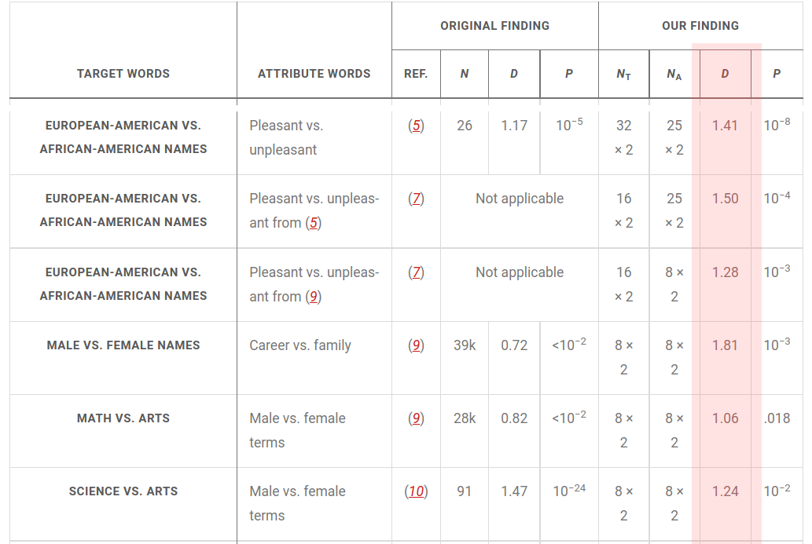
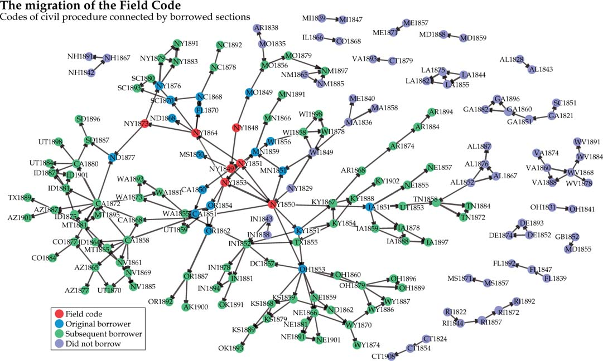

### The Digital Society

Our current society is a *Digital Society*. More and more of our actions happen through digital technologies, for example:  

- Searching for a job online   
- Talking with a family member over the phone  
- Sharing open source code  
- Posting a video on a social networking site  
- Paying at the supermarket with a credit card  
- Chatting with your boss on a company instant messenger  

The growth in adoption and evolution of these technologies is the **digital transformation** of society, which has some consequences:

- Digital technologies generate data traces that can persist and be analyzed (*datafication*)  
- How individuals interact with digital technologies is based on the code of software running on them. The design of that code is based on *algorithms* that describe the rules of how the technology works  
- Digital technologies might use data produce by humans in their algorithms, for example through machine learning *models* to personalize content or make predictions

### What are Computational Social Systems?

Systems in which humans and machines interact through Information and Communication Technologies (ICT). For example social media, mobile phone networks, programming collaboration platforms, enterprise resource planners, online videogames... 

Computational social systems generate new social phenomena that did not exist before the digital transformation, motivating research and technology development that we will discuss in the Social Computing topic.

Computational social systems produce new data on human behavior that is transforming the social and human sciences, as well as creating new business opportunities and legal issues. We will discuss about that in the [Social Data Science topic](https://dgarcia-eu.github.io/FoundationsOfCSS/01_Introduction/012_SocialDataScience/SocialDataScience.html).

Here, we are going to see an example of the study of computational social systems from four disciplines: Psychology, Sociology, Business analytics, and Law studies:

### Psychology example: Mood oscillations on Twitter

In 2011, Scott Golder and Michael Macy showed how Twitter data could be used to study mood oscillations in a [famous paper in Science](https://www.science.org/doi/full/10.1126/science.1202775). The processed about 500.000 tweets from different countries, running a sentiment analysis method that detected the use of positive and negative affect words (we will learn more about this method later in the course). They studied how the expression of affect in tweets oscillated over a day, across days of the week, and throughout the year. A plot showing the daily oscillations for each day of the week can be seen below.

  

That study allowed the researchers to test whether the changes in mood over the year were associated with the change in the number of daylight hours in a day (days shortening or getting longer). They found that when days are increasing, the mood of Twitter users looks more positive but no changes in negative mood, thus finding some of the first evidence of that effect across countries and over time.

### Sociology example: Gender bias in language models

Current intelligent technologies to analyze text use word embedding models. These models use large amounts of text from social media, news, or Wikipedia to measure the similarity of words. [Caliskan and colleagues](https://www.science.org/doi/10.1126/science.aal4230) compared the associations of this kind of models with the associations that humans make in a test designed to measure human biases, such as associating male names with scientific terms. There results are highlighted in the table below and compared with human biases in terms of associations between gender and race and other attributes like pleasantness or professional aspects:
  

The metric D measures the bias in this association, and thus the results show consistent biases in the language model, similarly to human biases and apparently even stronger in many cases. The model captures some other associations that are not considered biases, for example when one gender is more represented in a profession than other, which you can see in [the original article](https://www.science.org/doi/10.1126/science.aal4230). Identifying and correcting biases that distort the reality is a current problem to ensure that applications of those models do not discriminate people, for example when ranking job applications based on the text of resumes or cover letters.

### Business example: Understanding flash crashes

In stock markets, humans trade with machines that run automatic trading algorithms that use information on market prices as well as other external sources of information. Sometimes the actions of trading bots influence the actions of other bots, generating extremely fast changes in price. When these changes are drops in price, they are often called *flash crashes*. The figure below shows two examples of this kind of ultrafast changes in pricing, often lasting less than 1.5 seconds. You can find more about this analysis in the paper by [Johnson and colleagues](https://www.nature.com/articles/srep02627).

  

New regulations aim to prevent flash crashes, but this serves as a cautionary example about the possibility of machines synchronizing their behavior in a way that can have serious economic consequences. For example, in 2013 the Twitter account of Associated Press in the US was hacked and the hackers posted a tweet announcing that the White House was under attack. Trading bots detected this tweet and generated a flash crash in the Dow Jones Industrial Average, which was stopped by humans when they noticed that the news were obviously fake. You can find more about this in the [2013 Washington Post article](https://www.washingtonpost.com/business/economy/market-quavers-after-fake-ap-tweet-says-obama-was-hurt-in-white-house-explosions/2013/04/23/d96d2dc6-ac4d-11e2-a8b9-2a63d75b5459_story.html).

### Law example: Mapping legal influence

Funk and Mullen, two legal scholars, recently [analyzed the text of thousands of pages of legal texts](
https://academic.oup.com/ahr/article/123/1/132/4840258) to map the influence of a late 19th century legal practice known as the Field Code. This allowed them to connect texts to each other based on which influenced which:

  

Their findings show how one of the most influential approaches to writing legal code spread over the legal system. Similar applications of this approach to identify influence relations over text have been applied to legal texts from the [London Old Bailey](https://www.pnas.org/content/111/26/9419) and even to the [text of tweets](https://dl.acm.org/doi/10.1145/1557019.1557077).
