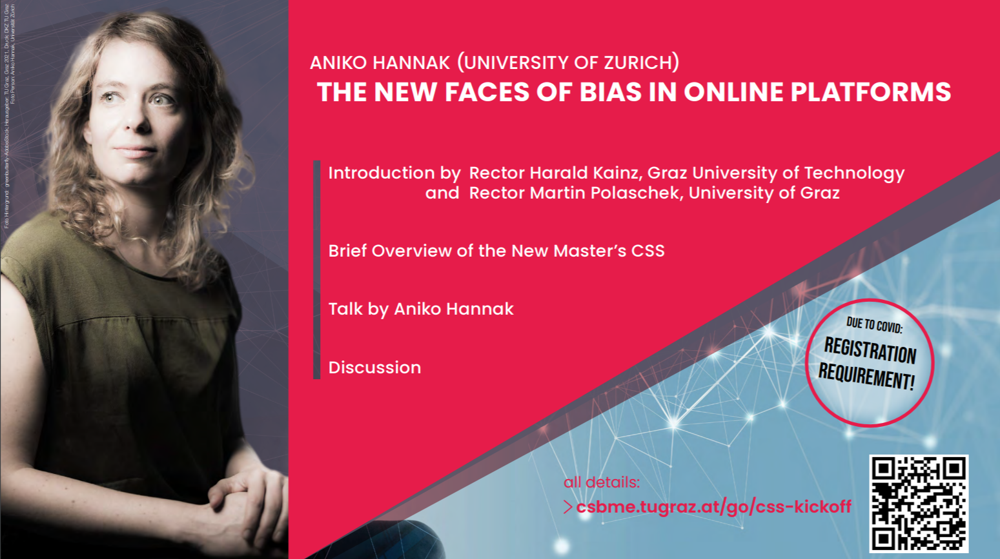
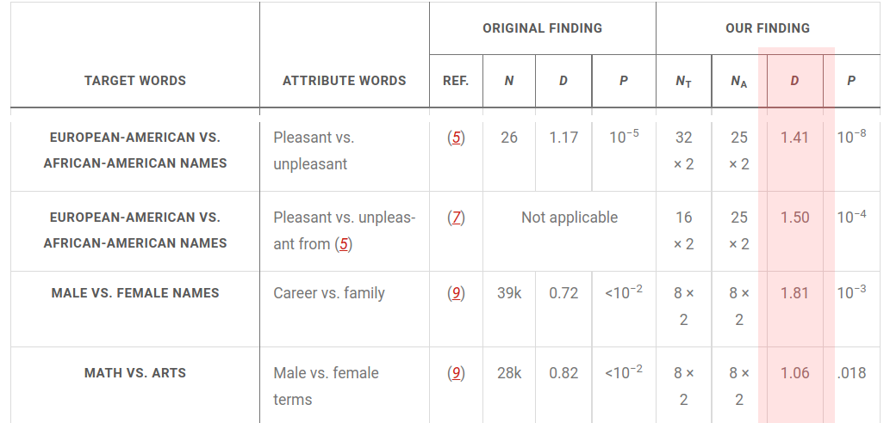

```{r xaringan-themer, include=FALSE, warning=FALSE}
#This block contains the theme configuration for the CSS lab slides style
library(xaringanthemer)
library(showtext)
style_mono_accent(
  base_color = "#5c5c5c",
  text_font_size = "1.5rem",
  header_font_google = google_font("Arial"),
  text_font_google   = google_font("Arial", "300", "300i"),
  code_font_google   = google_font("Fira Mono")
)
```

```{r setup, include=FALSE}
options(htmltools.dir.version = FALSE)
```

layout: true

<div class="my-footer"><span>David Garcia - Foundations of Computational Social Systems</span></div> 

---

# About me

.pull-left[
.center[
```{r, echo=FALSE, out.width=270}
knitr::include_graphics("Profile.jpg")
```
]]

.pull-right[
<br>
Website: [dgarcia.eu](https://dgarcia.eu)

Twitter: [@dgarcia_eu](https://twitter.com/dgarcia_eu)

Github: [dgarcia-eu](https://github.com/dgarcia-eu)

Email: garcia@csh.ac.at
]

- Professor for Computational Behavioral and Social Sciences at TU Graz
- Faculty member of the Complexity Science Hub Vienna
- Group leader at the Medical University of Vienna

---

# Course objectives

1. Learning the fundamentals of computational methods and data science to study **human behavior** and technological phenomena in the digital society. 

2. To understand methodological **opportunities and limitations**, as well as how to apply these methods in practical sessions.

3. How to plan, execute, and reflect on the **empirical analysis** of digital trace data to address questions about human behavior and emergent technological phenomena. 

4. Special emphasis on an **interdisciplinary approach** that can inform students from various disciplines.

---

# Course topics

- 7.10.2021: **Introduction to Computational Social Systems**
  - Tutorial session: R crash course part 1 *(Please install RStudio before)*
- 14.10.2021, 5:15: Supplementary lecture at **Computer Science Faculty Day**, TU Graz Aula
- 21.10.2021: **Search Behavior**
  - Tutorial session: R crash course part 2
- 28.10.2021: **Social Trends**
  - Tutorial session: Data wrangling with dplyr 
  - Week exercise: Future orientation and economic development
- 4.11.2021: **Social Impact**
  - Week exercise: The Twitter API in R
- 11.11.2021: **Social Media Text Analysis**
  - Week exercise: Division of impact on Twitter

---

- 18.11.2021: **Supervised Sentiment Analysis**
  - Week exercise: Running unsupervised sentiment analysis in R
- 25.11.2021: **Social network analysis** 
  - Week exercise: Evaluating sentiment analysis methods
- 2.12.2021: **Centrality in social networks** 
  - Week exercise: Handling network data in R
- 9.12.2021: **Social resilience of online communities** 
  - Week exercise: Swiss politician data on Twitter
- 16.12.2021: **Online social network structures** 
  - Week exercise: Twitter network analysis
- 13.1.2022: **Societal issues** 
  - Solution session for last exercise and project feedback
- 20.1.2022: **Ethical and scientific issues** 
  - Project feedback
- 27.1.2022: **Project presentations** 

---
## Inauguration of CSS programme

- Monday Oct 11th. Doors open at 16:30, start at 17:15. Socializing afterwards!

.center[]
---

# Time, place, online

- Lecture time:  Thursdays at 14:15 (sharp)
  - Lecture place: lecture room i3 in the Inffeldgasse campus of TU Graz  
- Exercise group 1 time: Thursdays after Lecture (approx. 16:15)
  - Exercise group 1 place: Same room (i3)
- Exercise group 2 time: Tuesdays at 13:00 (sharp)
  - Exercise group 2 place: room HS II at Rechbauerstrasse 12

Group 2 covers the same content as group 1 the previous Thursday.

Handouts, codes, and data can be found on the Github repository of the course: https://github.com/dgarcia-eu/FoundationsOfCSS   
Exercises are based on the R statistical language with RStudio.

Foundations of CSS Discord (only this course): https://discord.com/invite/HSCFE8fAdx Use it to ask for help!


---


# Projects information

The assessment for the course is based on the final group research project.
Groups can have at most 4 students and must mix students with different backgrounds.

- Empirical analysis project: data retrieval, processing, analysis, and interpretation. 

- Research questions are very important! (more about that later)

- Can be linked to project in Introduction to CSS. Great opportunity to start working together on a follow-up project in the programme

- We will post project ideas, you can pick from those, reproduce a previous paper, or bring your own idea. 

---

# Course assessment

- The **group** project grade is a combination:
  - ten-minute presentation (50%)
  - six-page written report on the project (50%).

- **Individual** extra points (max 20%) can be achieved by delivering two optional exercise solutions: 
  - "Division of impact on Twitter" (deadline 17.11.2021)
  - "Assortativity among Swiss politicians on Twitter" (deadline 12.1.2022).

- Lecture+Exercises (VU): projects are mandatory

- **Questions?**

---
# Course feedback

- Course Feedbackr: https://fbr.io/join/iuidc
- Quizzes during lectures
- General feedback question after every session. Please use it!
.center[]

---

# The Digital Society

.pull-left[
More and more of our actions happen through digital technologies, e.g.:

- Searching for a job online   
- Talking with a family member over the phone  
- Sharing open source code  
- Posting a video on a social networking site  
- Paying at the supermarket with a credit card  
- Chatting with your boss on a company instant messenger  
]
.pull-right[

]
---

# The Digital Transformation

The growth in adoption and evolution of these technologies is the **digital transformation** of society, which has some consequences:

- **Datafication**: Digital technologies generate data traces that can persist and be analyzed 

- How individuals interact with digital technologies is based on the code of software running on them. The design of that code is based on **algorithms** that describe the rules of how the technology operates  

- Digital technologies might use data produce by humans in their algorithms, for example through machine learning **models** to personalize content or make predictions

---

## What are Computational Social Systems?

Systems in which humans and machines interact through Information and Communication Technologies (ICT). For example social media, mobile phone networks, programming collaboration platforms, enterprise resource planners, online videogames... 

.pull-left[
Computational social systems generate **new social phenomena** that did not exist before the digital transformation

Computational social systems produce **new data on human behavior** that is transforming the social and human sciences
]
.pull-right[

]


---

# Example: Mood oscillations on Twitter


.center[  ]
 Golder & Macy, Science, 2011

---
## Example: Gender bias in language models
  
Caliskan et al. Science, 2017
 